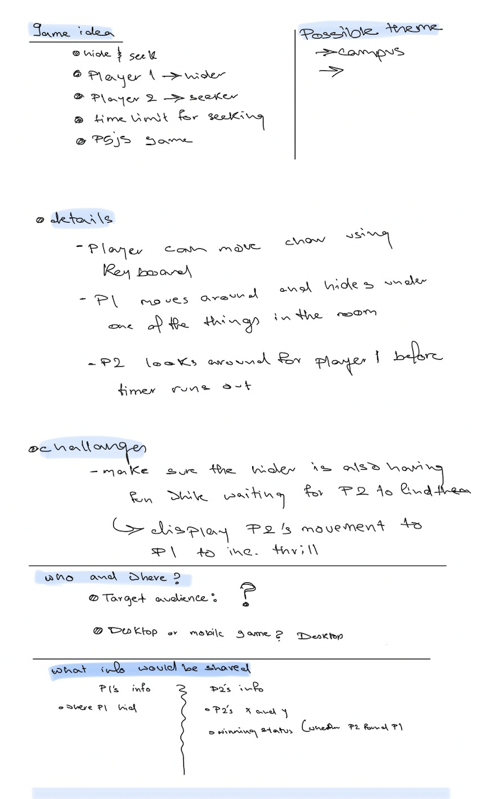
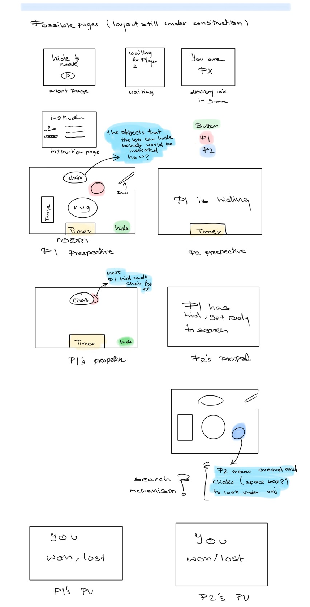

# Connection_Lab_project_2
## [project Link](https://melted-sun-one.glitch.me/)
##
##
##

## production decisions (i.e. technical, design, conceptual, creative etc)
#### ⭕️ planning
we first noted down the details of our idea. We wanted to make sure we understand the target audience and the challenges that we must face. This would help us know what we would focus on and get a better idea of the design aspects. 
We also made sure to note down the overall steps, and made lists with bugs we encountered and any new steps that we thought were necessary after we started building the projecct.
This is an example of the inetial project idea notes. (we filled the gaps in our later meetings)

  

We then created the wireframes. This helped us visualize the project and the storyline and make sure that our visions align. Laying out the pages helped us when building the game becuase we have the pages and their order and the possible layout and needed elements for each page (buttons... etc) 

  

<!--  -->

#### ⭕️ front end (design)
We decided that the game was going to be a p5js game. Our first draft was one room with a player with basic functionality and elements (popups, movement, hiding...) 
[Initial one player room](https://editor.p5js.org/Nouf-Alabbasi/sketches/SaNU4HA9x) 
Once we tested that this works as intended, we moved on to create the seeker's version. using functions and classes made this steps a little easier. After testing we then moved on to creating the start, instruction and end pages. This was changed a little after testing but the main functionalities remained the same. We now had a game that has a hider and seeker views and the functionalities for both sides, however they are not connected yet. In the next section we talk about the backend, but as for the front end, after adding the sockets we expanded the eviroment to add more hiding places and rooms.

#### backend end
We decided to use sockets as our main way of communicating between the two players. This was done because the current design of the game does not have data that needs to be stored long term hence the primary information does not need to be stored and retrieved from databses. Socket.io was used to implement sockets. This allowed for real-time communication between the two players. Game data was stored on the client entirely. Only movement and actions are sent over the server. This allows for very minimal transfer required and hence low latency for the game.

## ⭕️ influences and inspiration
We were inspired by retro games. This is why we used the audio and visuals that we used. We picked to recreate hide and seek as an online game becuase we haven't seen it done before. We thought it would be an intresting challenge to try to take a game that everyone knows and recreate the thrill you feel while playing it in real life. 

## challenges and solutions
delay
creating delay in the game was specifically a challenge because of the use of p5js to create the game. In p5, the draw function runs 60 (default) times every second, this makes it so that setTimeout and setInterval may not work as well. This was then solved by creating a delay using promises and async functions. The delay function is created here:
https://github.com/Nouf-Alabbasi/Connection_Lab_project_2/blob/bf89c1a59da6ba7d421746c4ce12049ac0a6bafc/public/app.js#L147
This stops all JavaScript code from continuing for the argument passed in milliseconds.
Maintaining the seeker's view
adding all the things that make the game intuitive to the user
  we can also talk about user testing somewhere and how we made changes to the game to according to what we found out 

## overall lessons learned (maybe this should be in the individual paragraphs?)

## potential next steps
some of the potential next steps include:
* Adding hints of some sort (hot an cold, or letting the hider peep out... etc)
* Adding a restart mechanism
* Adding more players
* adding rooms (sockets)
* fixing some minor bugs

## relevant references/resources that were utilized
* for the sprites and imgs we used a few game sites that provided game assets.

## individual paragraphs
<!--- I think we write about our contributions and our experience ??)-->
#### Hashim's paragraph

#### ⭕️ Nouf's pragraph
I really enjoyed working on this project. It was really cool to finally see the project running online with players on different devices! In this project I wanted to focus on the pre project preperation in terms of ideation and creating the frameworks. So in our first few meetings we made sure to have a clear idea about the project in terms of basic idea, challanges, desgin elements and so on. We also made sure to keep track of the steps we have already gone through and the ones we still need finish. We also kept track of bugs and potential new ideas for things in the project. This was really helpful becuase we we're a team working on this project. I worked on the initial front end and wanted to try to keep the code clean, modular, and intuitive, I think that I did well on the later two goals, but feel like I could do better on the first. There are a few variables that we're used in a version of the code that we scratched that remain in the final version. I think for next time I'll make sure to delete all associated variables when deleting a code block which reduces the need to look for them later on when cleaning the code.
